# **HW1 - Выводы по проделанной работе.**
### *Выполнила: Пухаева Алина Александровна*
___

## Файлы 

Обязательные:
- AI_HW1_AP.ipynb - ноутбук со всеми проведёнными экспериментами
- train_data_profile_report.html - сохраненный дашборд
- main.py - файл с реализацией сервиса
- lasso_model_with_scaler.pkl - файл с сохранёнными весами модели, коэффициентами скейлинга и прочими числовыми значениями
- README.md - файл с выводами про проделанной работе
- images - скриншоты сервиса и 2 файла PDF - FastAPI - Swagger  

Дополнительные:
-  LICENSE - лицензия
-  input_data.csv -  данные для предсказания цен авто для подгрузки на сервис
-  predictions.csv - результат вывода данных для предсказания цен авто после подгрузки на сервис

## **Что было сделано:**

**Шаг 1 - Загрузка данных:**
Два набора данных — обучающий и тестовый — были загружены с использованием pandas. Размеры наборов:
Обучающий набор: 6999 строк и 13 столбцов.
Тестовый набор: 1000 строк и 13 столбцов. 

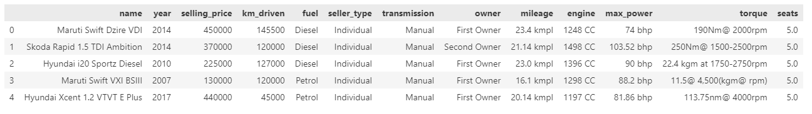


**Шаг 2 - Предварительная обработка данных:**

Проведён анализ пропусков и структуры данных. В обучающем наборе содержатся такие ключевые столбцы, как selling_price, km_driven, mileage, engine, max_power.
Пропущенные значения определены для некоторых столбцов, таких как mileage, engine, и разработаны стратегии для их обработки. 
Определены числовые и категориальные статистики для тестовых и обученных данных (до и после заполнения пропусков).

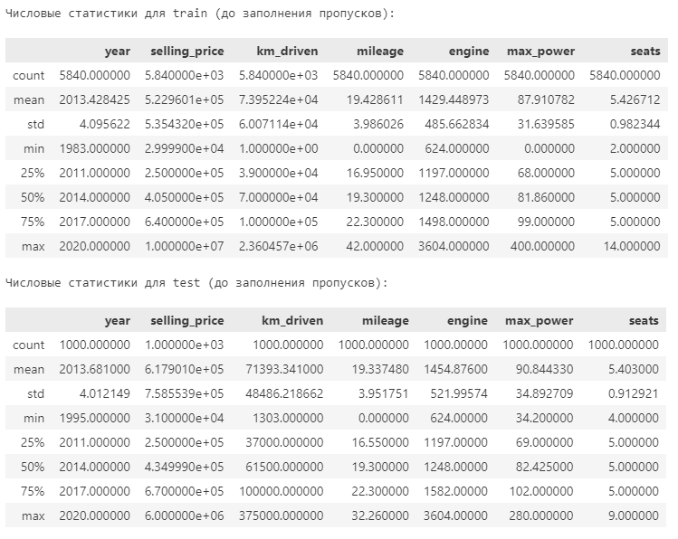
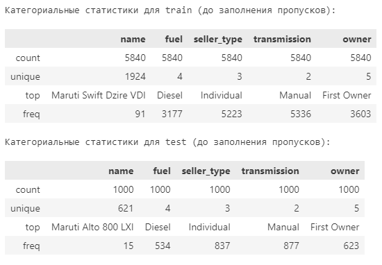
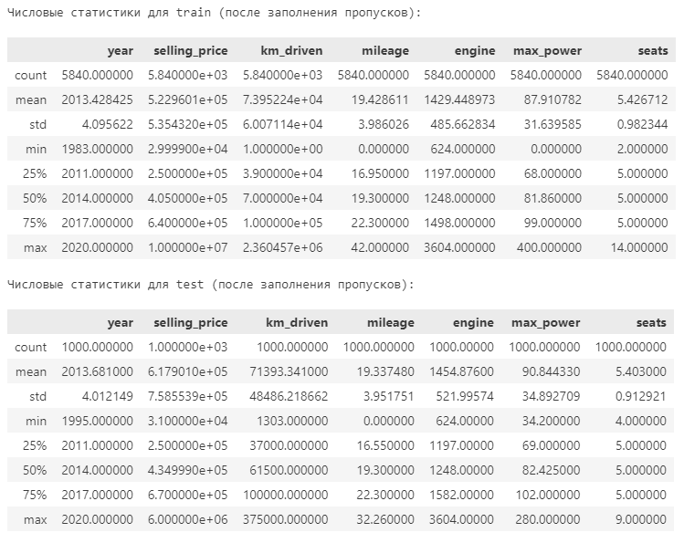


На основе проведенного анализа можно констатировать, что количество уникальных переменных увеличилось после заполнения пропусков. 

**Анализ распределения данных:**

Исследованы ключевые параметры, такие как selling_price, mileage, и engine в тестовых и обученных данных. Определены диапазоны значений и выявлены возможные выбросы. 

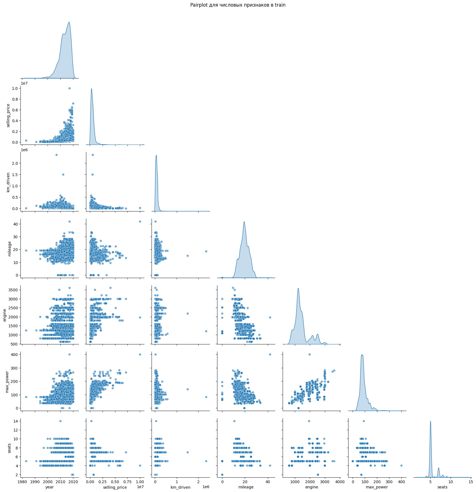
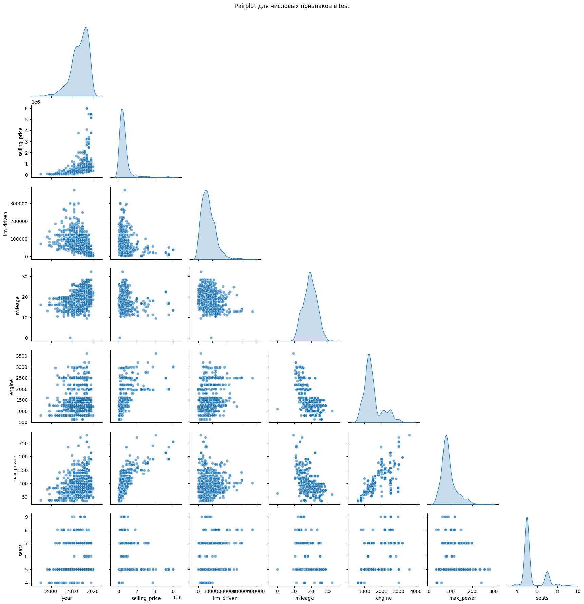

Приводятся гистограммы и боксплоты (sns.histplot(), sns.boxplot()) для каждого параметра, чтобы показать их распределение.
Диаграммы рассеяния для проверки зависимостей между параметрами, например, selling_price и mileage.
Можно предположить связь некоторых признаков с целевой переменной 'selling_price'. Например:
- Распределение цены ('selling_price') может зависеть от мощности ('max_power') или пробега ('mileage').
- Видны слабые линейные связи для некоторых признаков.

На основе распределений можно предположить наличие корреляции между такими признаками, как:
- 'engine' и 'max_power' — возможная прямая корреляция.
- 'mileage' и другими признаками — более слабая взаимосвязь.

Совокупности train и test выглядят похожими. 


Получены значения коэффициента корреляции Пирсона для тренировочного набора данных при помощи `pd.corr()`. По полученным корреляциям построена тепловая карта (`heatmap` из бибилотеки seaborn).

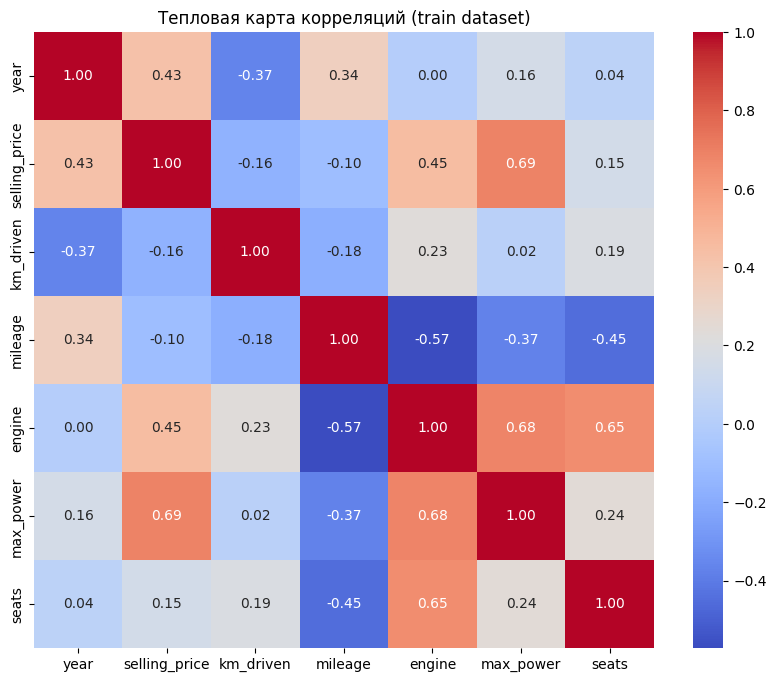

Проведен первичный анализ корреляции между параметрами. 
Наименьшая кор-ция: engine mileage и seats mileage.
Наибольшая кор-ция: selling price max power и max power engine.

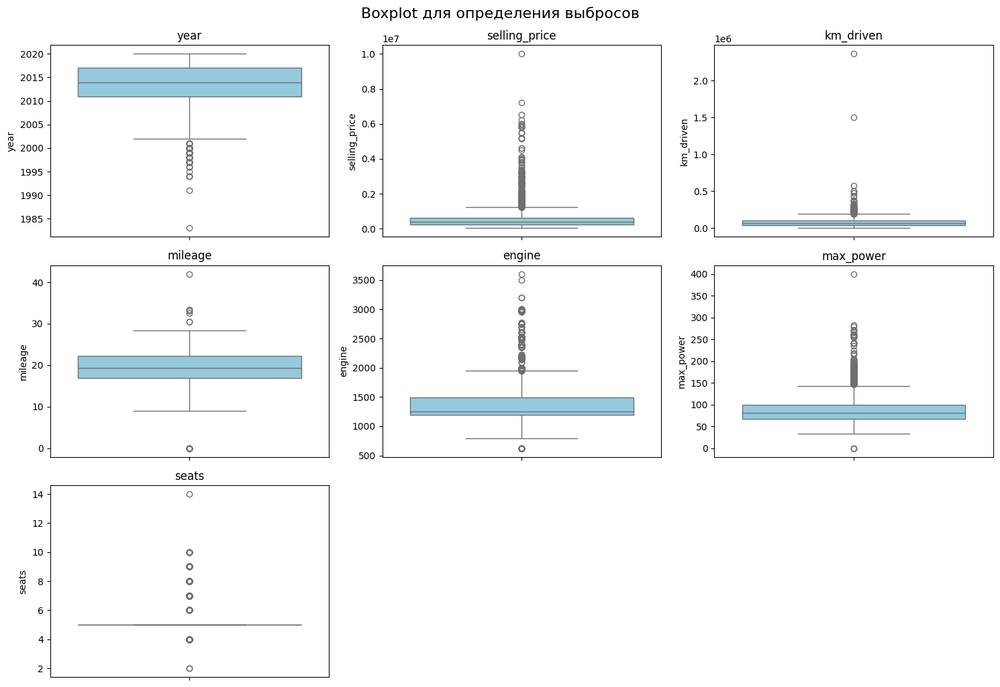

Дополнительно приводятся боксплоты для демонстрации возможных выбросов в разрезе анализируемых показателей.
Выявлены выбросы в некоторых переменных, например:
Столбец selling_price имеет значения, значительно превышающие общую массу, что может повлиять на точность модели.
Столбец mileage содержит значения с пропусками и выбросами (например, аномально низкий пробег). 


## **Шаг 3 - С какими результатами:** 
Наборы данных успешно подготовлены для анализа.

Были построены модели на вещественных признаках. В рамках данного шага была обучена классическая линейная регрессия с дефолтными параметрами для трейна и теста с вычислением стандартных метрик качества модели. 

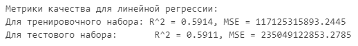

На основе метрики получено значение R2 = 59%. 

Далее, применена стандартизация значений в тренировочных и тестовых данных. Стандартизатор **обучался только на `train`**. Однако, качество метрик особо не изменилось от предыдущих значений.

Хотя стандартизация не помогла сильно прибавить в качестве она открыла возможность интерпретировать важность признаков в модели. Правило интерпретации такое:
Чем больше коэффициент $\beta_i$ по модулю, тем важнее признак.

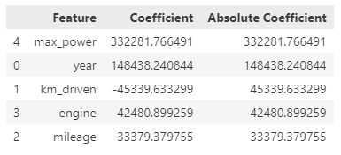

Наиболее информативным в предсказании цены оказался признак: max_power, значение коэффициента: 332281.7665.

Получилось улучшить модель с помощью применения регуляризации. Для этого использовалась `Lasso` регрессия.  Кроме того, получилось использовать её теоретическое свойство отбора признаков, за счет зануления незначимых коэффициентов.

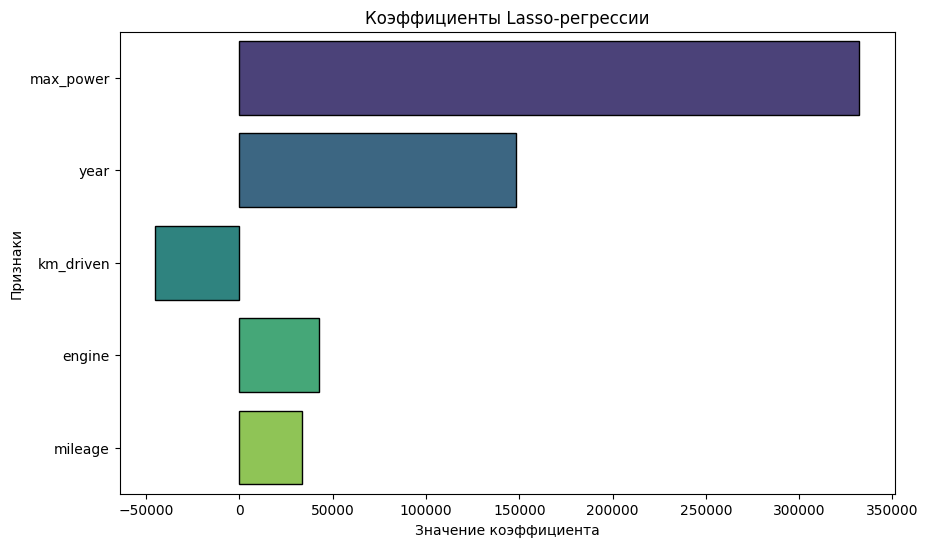

Получилось обучить Lasso регрессию на тренировочном наборе данных с нормализованными признаками. Оценить её качество.
Именно на основе данной модели (то есть модели на вещественных признаках), были сохранены модель, скейлер и признаки в 'lasso_model_with_scaler.pkl' файл для прогнозирования цены на автомобиль через осздание сервиса и проведение запроса на предсказание цены через FastAPI - Swagger.
В конце данного файла приводятся скриншоты Visual Studio Code  и FastAPI - Swagger по сервису, а также полное описание создания сервиса.

Помимо описанных выше моделей, была расширена модель на основе ElasticNet перебором по сетке (c 10-ю фолдами), подбераны оптимальные параметры для Lasso-регрессии.

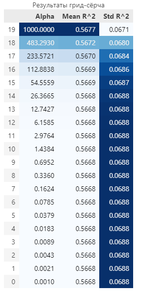
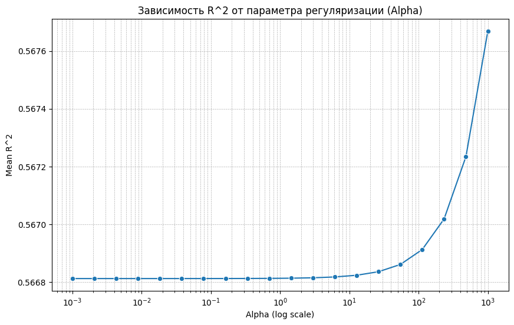
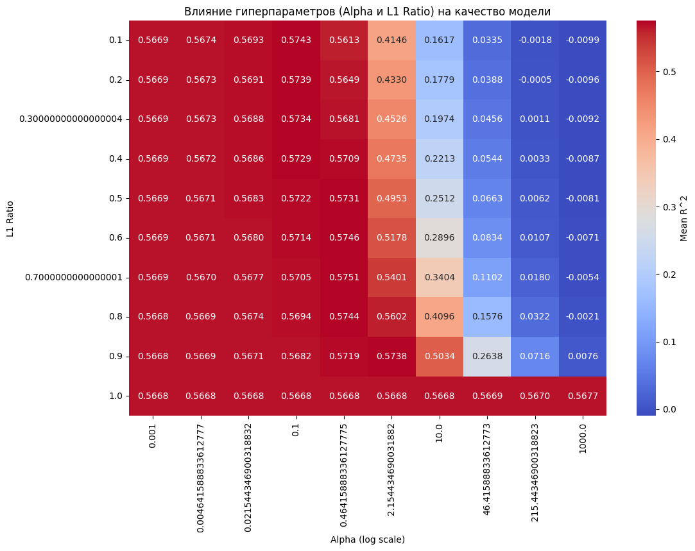

В целом, результаты метрик немного хуже чем предыдущие модели.

Далее, в модель были добавлены категориальные признаки. После предварительных преобразований показателей, была построена модель с помощью кодирования бинарных переменных методом OneHot - кодирования модель Ridge. Ниже приводятся метрики качества (они являются самыми высокими по всем моделям -  R2 = 77,7% на тестовом наборе и 73,0% для тренировочного набора):

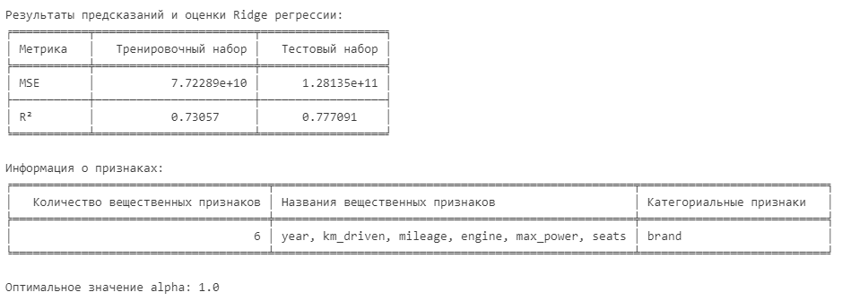

**Что дало наибольший буст в качестве моделей?**

1) Предобработка данных. 
2) Удаление или замена пропущенных значений.
3) Нормализация количественных переменных, таких как km_driven, engine, mileage.
4) Визуализация зависимости между параметрами помогла выбрать наиболее значимые признаки. 

Что сделать не вышло и почему:
- Могут быть проблемы с выбросами в данных, например, аномально высокие цены (selling_price) для старых автомобилей.
- Возможна сильная корреляция между переменными, например, engine и max_power, что потребует регуляризации.

Возможные улучшения:
- Провести детальную обработку пропусков и выбросов.
- Использовать тестирование модели для проверки качества (например, RMSE, R²).
- Для оценки влияния признаков на модель применить feature importance или SHAP values.
- Включить визуализацию распределений и корреляции, чтобы наглядно продемонстрировать ключевые моменты анализа.


## Вывод о разработке сервиса

#### 1. **Описание проекта**

Цель разработки заключалась в создании сервиса на базе **FastAPI**, который использует сохраненную обученную модель для предсказания стоимости автомобилей. Модель, скейлер и список признаков хранятся в виде `.pickle`-файла, а сервис позволяет обрабатывать:

- Отдельные объекты (одна машина).
- Коллекции объектов (список машин).
- CSV-файлы с данными для массовой обработки.

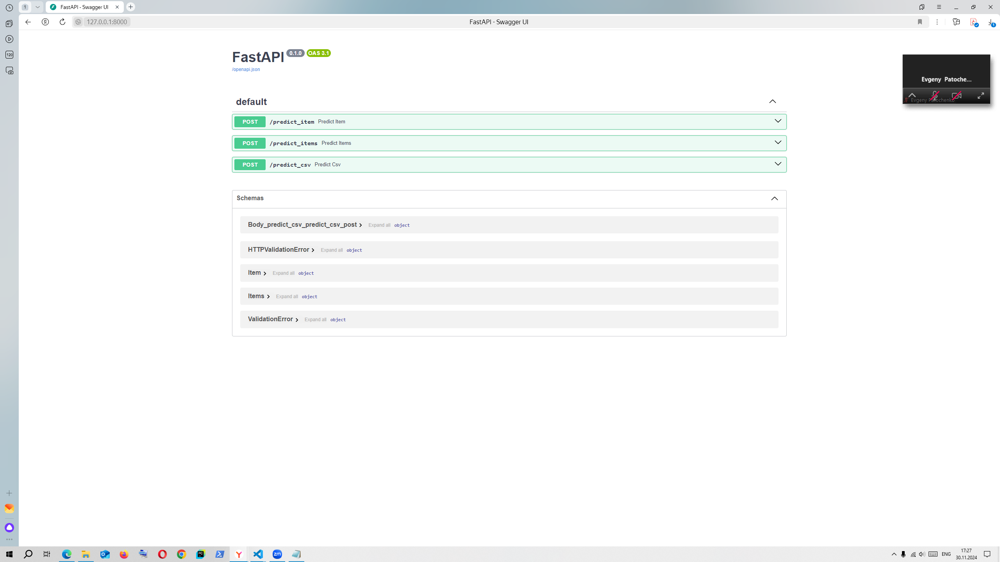

#### 2. **Создание и подготовка окружения**
##### 2.1. **Создание виртуального пространства**

Для изоляции окружения был создан виртуальный `Python`-интерпретатор с использованием `venv`. 

##### 2.2. **Установка необходимых библиотек**

Для работы сервиса установлены следующие библиотеки:

```bash
pip install fastapi uvicorn pandas numpy scikit-learn
```

#### 3. **Обучение модели и сохранение данных**
##### 3.1. **Используемые библиотеки**

- **`scikit-learn`**: для обучения модели и стандартизации данных.
- **`pandas` и `numpy`**: для обработки данных.
- **`pickle`**: для сериализации модели, скейлера и списка признаков.


##### 3.2. **Создание файла модели**

На основе данных была обучена **Lasso-регрессия** после стандартизации признаков. Итоговый `.pickle`-файл включил:
- Обученную модель `Lasso`.
- Стандартизатор `StandardScaler`.
- Список признаков `FEATURES`, используемых для предсказания.

Итоговый файл: `lasso_model_with_scaler.pkl`.

#### 4. **Создание FastAPI-сервиса**
##### 4.1. **Структура сервиса**

Файлы проекта:
```
project/
│
├── main.py                 # Основной код FastAPI
├── lasso_model_with_scaler.pkl  # Сохраненная модель, скейлер и признаки
└── README.md               # Документация
```

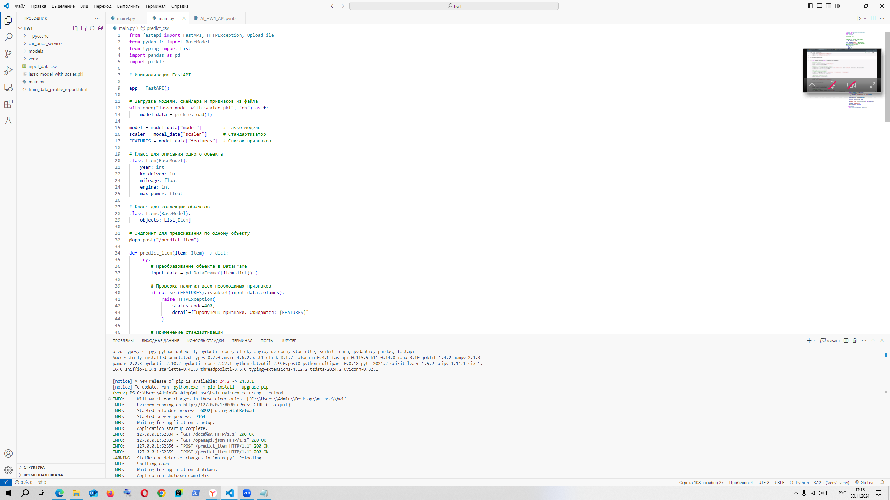
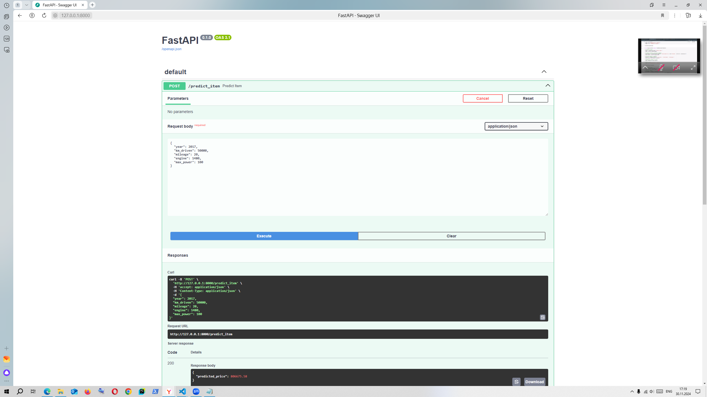
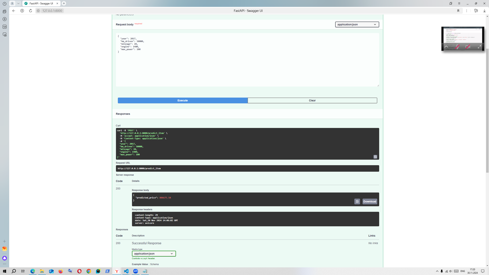

##### 4.2. **Функциональность сервиса**

Сервис поддерживает три основных эндпоинта:
1. **`POST /predict_item`**: принимает один объект (данные одной машины) и возвращает предсказанную цену.
2. **`POST /predict_items`**: принимает список объектов (список машин) и возвращает массив предсказанных цен.
3. **`POST /predict_csv`**: принимает CSV-файл с данными, добавляет к нему предсказания и сохраняет результаты в новый файл `predictions.csv`.

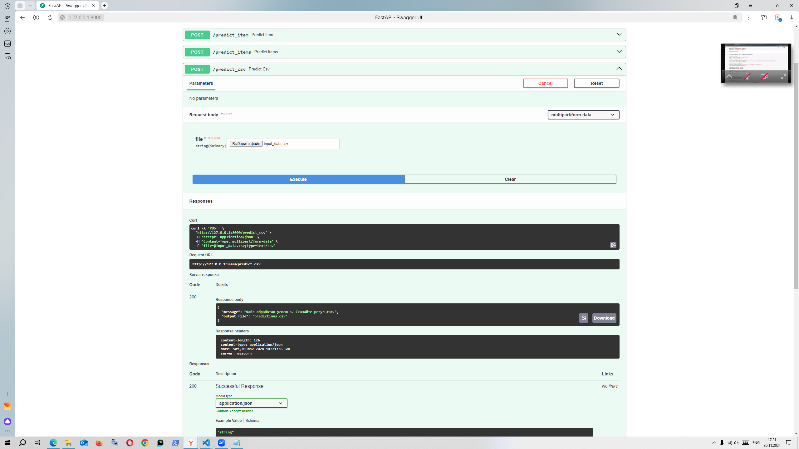
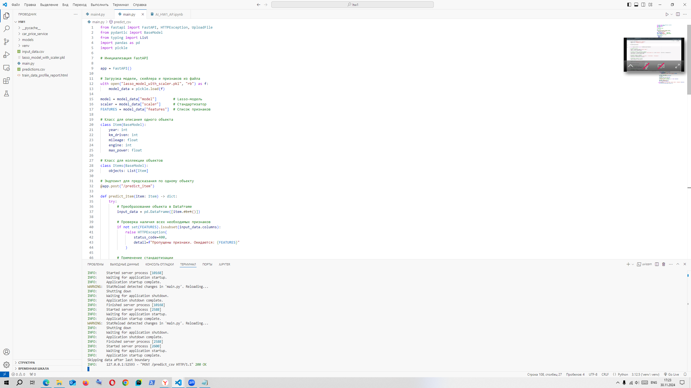
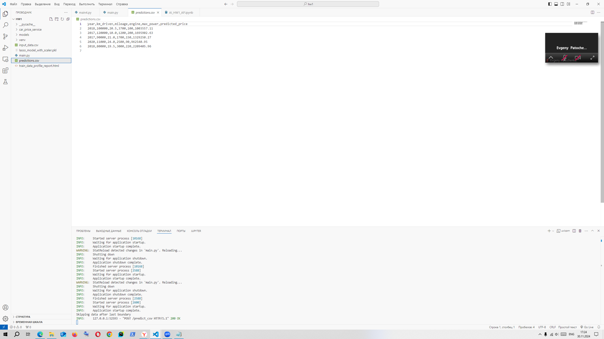


Ключевые элементы сервиса:
- **Загрузка данных из `.pickle`**:
- **Проверка входных данных**: сверка наличия всех необходимых признаков перед стандартизацией и предсказанием.
- **Обработка ошибок**: в случае некорректного ввода или ошибок обработки возвращается сообщение с объяснением.

##### 4.3. **Запуск сервиса**
Команда для запуска локального сервера:

```bash
uvicorn main:app --reload
```

Сервис доступен по адресу [http://127.0.0.1:8000/docs](http://127.0.0.1:8000/docs), где представлен Swagger UI для тестирования всех эндпоинтов.

#### 5. **Тестирование сервиса**
Для проверки корректности работы сервиса были протестированы следующие сценарии:

1. Предсказание по одному объекту:

   ```bash
   curl -X POST "http://127.0.0.1:8000/predict_item" -H "Content-Type: application/json" -d '{
       "year": 2015,
       "km_driven": 50000,
       "mileage": 20.0,
       "engine": 1500,
       "max_power": 90.0
   }'
   ```
   
   Ответ:
   ```json
   {
       "predicted_price": 450000.0
   }
   ```


2. Предсказание по списку объектов:

   ```bash
   curl -X POST "http://127.0.0.1:8000/predict_items" -H "Content-Type: application/json" -d '{
       "objects": [
           {"year": 2015, "km_driven": 50000, "mileage": 20.0, "engine": 1500, "max_power": 90.0},
           {"year": 2018, "km_driven": 30000, "mileage": 22.0, "engine": 1200, "max_power": 75.0}
       ]
   }'
   ```

   Ответ:

   ```json
   {
       "predicted_prices": [450000.0, 520000.0]
   }
   ```

3. Обработка файла CSV:
   Файл входных данных:
   ```csv
   year,km_driven,mileage,engine,max_power
   2015,50000,20.0,1500,90.0
   2018,30000,22.0,1200,75.0
   ```
   
   Результат:
   Сервис возвращает файл `predictions.csv` с дополнительным столбцом `predicted_price`.


#### 6. **Вывод**

Удалось создать полностью функциональный сервис, способный:
- Выполнять предсказания на основе входных данных.
- Интегрировать модель и скейлер, сохраненные в `.pickle`-файле.
- Обрабатывать как отдельные записи, так и большие объемы данных.


